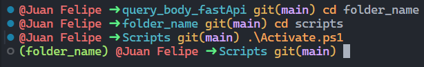

# FASTAPI
- Here you can find how to use FastApi, a simple practice with Body and Query method.

### Before to start
- Make sure to install the needed  packages, you can do it very ease using ***pip install*** on your terminal.

`pip install fastapi`

- as a best practice, before to install any package or library, activate your ***Python Virtual Environent*** or ***venv***.
- You can activate your ***venv*** using the netx comand on your termnal.

`python -m venv folder_name`

- then, using ***cd*** command you must enter to your **folder_name** and then, using again ***cd*** you must enter to the folder ***scripts*** that is created by defult when you run `python -m venv folder_name`
and finally you must run the command `.\activate.ps1`

### How I know that my venv is active?
- If you followed the previws steps, you will see somethig like this:

- when you see  ***(folder_name)*** at the begining of your path, that means that the **venv*** has been activated sucessfully and all the package and libraries will be installed on you ***venv*** and not on you local machine

### Finally, do not forget to import the library
`from fastapi import FastAPI, Body`
`from fastapi import FastAPI, Query`
`from pydantic import BaseModel`

and that's it, LET'S CODE !
